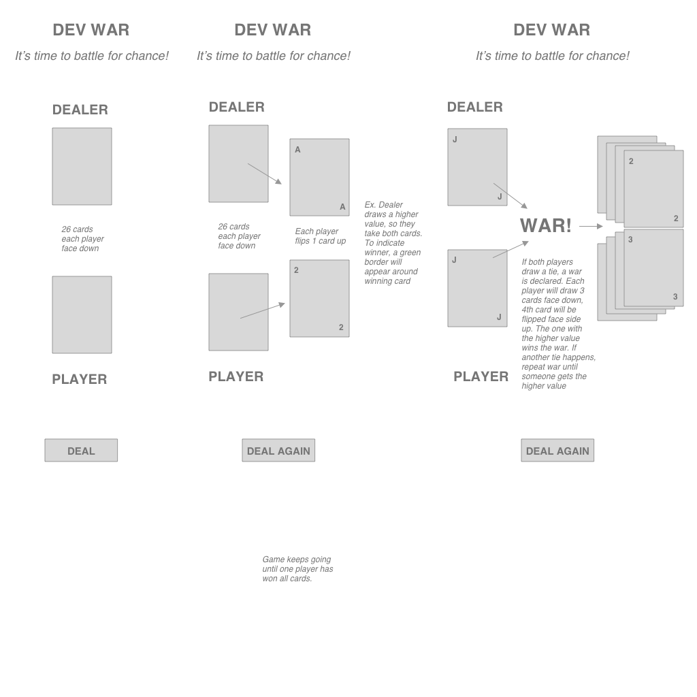
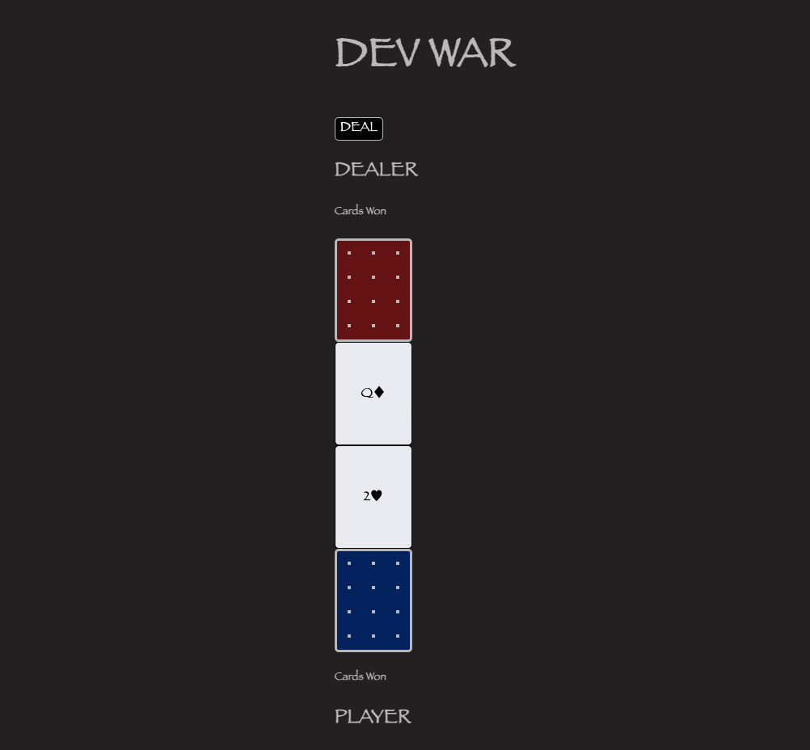
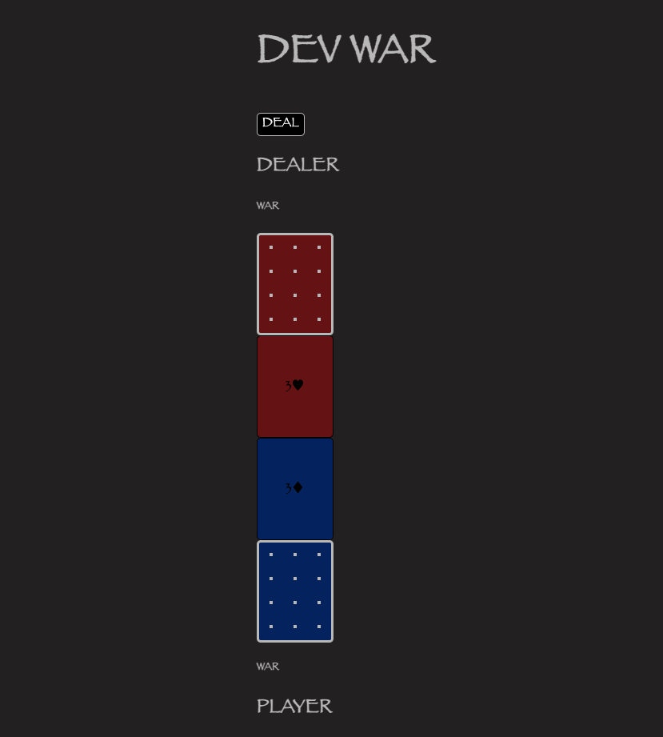

# DEV WAR

Take a chance at battle against the Dealer in this simple renaissance themed card game called **DEV WAR**. It’s all about chance and being the first to win all 52 cards. 

**Fun Fact**

You can find an array of different ways to play the game. My favorite is the Underdog, where the player with the lowest value at War wins if they have a Jack among the 3 war cards. Let some other ones = ['Casino War', 'Peace War', 'Prisoner of War', 'and so on'].

[DiAnne's Proj-1-DEV WAR GAME](https://ditabu.github.io/project-1-devwar)

**To Play**
1. Click on the DEAL button to start the game
2. Click on the top of your stack of cards (the blue color) to play
3. Highest to lowest values are as follows: A, K, Q, J, 10, 9, 8, 7, 6, 5, 4, 3, 2
4. If you draw a higher value, then you get both cards
5. If you draw a lower value, then dealer gets both cards
6. If you draw a card of the same value as dealer, then a war is declared. 
7. Click the top of your card 4 times, your 4th card will determine your fate at war
8. If you draw a higher value, then you get all cards
9. If you draw a lower value, then dealer gets all cards
10. If you draw a card of the same value as dealer, then a war is declared again...
11. Keep playing until you or the dealer wins all 52 cards! 

**Next Steps**

I plan to improve the look and feel of the game, as well as the functionality. Right now, the game is very simple. In the future, there will be animations to the game such as having the card flip over to reveal its value, options for choosing card colors, battle names and some css styling to it.

**Technologies used:** 
1. HTML
2. CSS
3. JavaScript
4. Sketch - for wireframe

